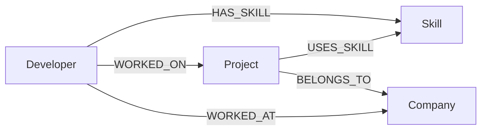

# DevGraph

DevGraph is a **Developer Skill & Project Explorer** — a full-stack application that lets users explore relationships between developers, skills, projects, and companies. It is backed by **CognoDB**, a managed graph database, and exposes a REST API with a React frontend.

## Use Case

DevGraph helps users discover connections between developers, skills, projects, and companies. Instead of running complex SQL joins, the application traverses a graph to answer questions like:

- Which developers have a given skill?
- Which projects use a particular technology?
- Which developers worked on projects in the FinTech industry?
- Which developers have similar skill profiles?

## Why a Graph Database?

Relationship traversal is central to DevGraph. Questions like *"Which developers are connected to FinTech companies through the projects they worked on?"* require chaining multiple entity types:

```
Developer → WORKED_ON → Project → BELONGS_TO → Company
```

In a relational schema, this needs multiple join tables (`developer_skills`, `developer_projects`, `project_companies`) and several `JOIN` clauses. Adding a new traversal path (e.g. through shared skills) means more joins and query complexity.

In a graph database, the same question is a natural path traversal — and extending it to include skill-based connections is a single additional hop, not a schema redesign.

## Architecture

```
React Frontend (Vite)
        ↓  REST / Fetch API
Spring Boot Controllers
        ↓
Service Layer
        ↓
Repository Layer (Neo4j Java Driver)
        ↓
CognoDB (openCypher over Bolt)
```

**Backend layers:**
- `Controller` — REST endpoints
- `Service` — business logic
- `Repository` — parameterized Cypher queries via the official Neo4j Java Driver
- `Config` — CognoDB connection, CORS

**Frontend layers:**
- `pages/` — route-level views
- `components/` — reusable UI
- `services/api.js` — centralized API client

## Technology Stack

* Java 17, Spring Boot, Maven
* Neo4j Java Driver (direct — no Spring Data Neo4j)
* CognoDB
* React, Vite, JavaScript

## Graph Data Model

The graph contains four node types:

| Node      | Key Properties                              |
|-----------|---------------------------------------------|
| Developer | id, name, email, experienceYears, location  |
| Skill     | id, name, category                          |
| Project   | id, name, description, domain               |
| Company   | id, name, industry, location                |

Five relationship types connect them:

| Relationship | From → To              |
|--------------|------------------------|
| HAS_SKILL    | Developer → Skill      |
| WORKED_ON    | Developer → Project    |
| WORKED_AT    | Developer → Company    |
| USES_SKILL   | Project → Skill        |
| BELONGS_TO   | Project → Company      |

### Mermaid Diagram



See [docs/graph-model.md](docs/graph-model.md) for full documentation and traversal examples.

## Seed Data

The seed script (`scripts/seed.cypher`) creates:

* 20 Developers with realistic names and locations
* 15 Skills (Java, Spring Boot, Python, React, etc.)
* 10 Projects (Payment Gateway, E-commerce Platform, etc.)
* 6 Companies across FinTech, Healthcare, Cloud, and other industries
* Interconnected relationships across all five relationship types

### Seed Instructions

Run the seed script against CognoDB using the included utility:

```bash
mvn compile dependency:build-classpath -Dmdep.outputFile=cp.txt -q
java -cp "target/classes:$(cat cp.txt)" com.devgraph.script.CypherScriptRunner scripts/seed.cypher
```

On Windows PowerShell:

```powershell
mvn compile dependency:build-classpath "-Dmdep.outputFile=cp.txt" -q
$cp = Get-Content cp.txt -Raw
java -cp "target/classes;$cp" com.devgraph.script.CypherScriptRunner scripts/seed.cypher
```

The script uses `MERGE` and is safe to run multiple times without creating duplicate nodes or relationships.

Alternatively, paste the contents of `scripts/seed.cypher` into the CognoDB query console.

## Main Graph Queries

Reusable Cypher queries are documented in `scripts/queries.cypher`. Key multi-hop queries:

| Query | Traversal | Purpose |
|-------|-----------|---------|
| Q1 | Developer → Skill | Find developers with a skill |
| Q2 | Project → Skill | Find projects using a skill |
| Q3 | Developer → Skill ← Project | Developers connected to projects through skills |
| Q4 | Developer → Project → Company | Developers in a given industry (3-hop) |
| Q5 | Developer → Skill + Project → Company | Skill + industry combined filter |
| Q6 | Developer → Skill | Developer skill profile |
| Q7 | Developer → Skill ← Developer | Similar developers by shared skills |
| Q8 | Similar devs → Project → Skill | Skill recommendations via graph |

All queries use Cypher parameters (`$skillName`, `$industry`, `$developerId`) — never string concatenation.

## Backend Setup

1. **Install Java** — Java 17 or later is required.

2. **Clone the repository**

   ```bash
   git clone <repository-url>
   cd Wexa-Assignment
   ```

3. **Set environment variables** before running:

   ```bash
   # Linux / macOS
   export COGNODB_URI=<your-cognodb-uri>
   export COGNODB_USERNAME=<your-username>
   export COGNODB_PASSWORD=<your-password>

   # Windows PowerShell
   $env:COGNODB_URI="<your-cognodb-uri>"
   $env:COGNODB_USERNAME="<your-username>"
   $env:COGNODB_PASSWORD="<your-password>"
   ```

4. **Build and run**

   ```bash
   mvn clean install
   mvn spring-boot:run
   ```

5. **Test health**

   ```bash
   curl http://localhost:8080/api/health
   ```

## Frontend Setup

The React frontend lives in the `frontend/` directory.

```bash
cd frontend
cp .env.example .env
npm install
npm run dev
```

The app opens at **http://localhost:5173**.

### Production build

```bash
cd frontend
npm run build
```

Serve the `frontend/dist/` directory with any static file host.

## Environment Variables

### Backend

| Variable | Description |
|----------|-------------|
| `COGNODB_URI` | CognoDB Bolt connection URI |
| `COGNODB_USERNAME` | CognoDB username |
| `COGNODB_PASSWORD` | CognoDB password |
| `CORS_ALLOWED_ORIGINS` | Comma-separated allowed frontend origins (default: `http://localhost:5173,http://localhost:3000`) |

### Frontend

| Variable | Description |
|----------|-------------|
| `VITE_API_BASE_URL` | Backend API base URL (default: `http://localhost:8080`) |

Example placeholders:

```
COGNODB_URI=
COGNODB_USERNAME=
COGNODB_PASSWORD=
CORS_ALLOWED_ORIGINS=http://localhost:5173,https://your-production-frontend.example.com
VITE_API_BASE_URL=http://localhost:8080
```

**Important:** Real credentials must never be committed to version control.

## API Endpoints

| Method | Endpoint | Description |
|--------|----------|-------------|
| GET | `/api/health` | Application and database health check |
| GET | `/api/developers` | List all developers |
| GET | `/api/developers/{id}` | Developer with skills, projects, and companies |
| GET | `/api/developers/search?skill=Java` | Developers with a given skill |
| GET | `/api/projects/search?skill=Java` | Projects using a given skill |
| GET | `/api/explore/industry?industry=FinTech` | Developers on projects in a given industry |
| GET | `/api/developers/{id}/similar` | Developers with shared skills |

### Test commands

```bash
curl http://localhost:8080/api/health
curl http://localhost:8080/api/developers
curl "http://localhost:8080/api/developers/search?skill=Java"
curl "http://localhost:8080/api/projects/search?skill=Java"
curl "http://localhost:8080/api/explore/industry?industry=FinTech"
curl http://localhost:8080/api/developers/dev-001
curl http://localhost:8080/api/developers/dev-001/similar
```

## Screenshots

<!-- Add screenshots here before final submission -->
<!-- Suggested: Home page, Developer profile, Industry explorer, Skill search results -->

_Screenshots to be added._

## Deployment

This project is prepared for deployment but **deployment is not yet complete**. Before going live:

1. Set production environment variables on the backend host
2. Set `CORS_ALLOWED_ORIGINS` to your production frontend URL
3. Set `VITE_API_BASE_URL` to your production backend URL and rebuild the frontend
4. Run the seed script against your production CognoDB instance
5. Add screenshots to this README
