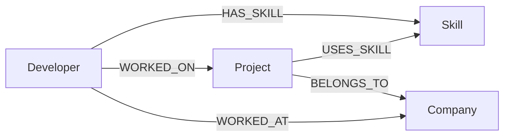

# DevGraph Graph Data Model

DevGraph models the professional ecosystem of developers, their skills, the projects they contribute to, and the companies they work for. Relationships are first-class citizens, enabling multi-hop traversals that answer questions a relational schema would struggle with.

## Node Types

### Developer

Represents a software professional.

| Property          | Type   | Description                    |
|-------------------|--------|--------------------------------|
| `id`              | String | Stable unique identifier       |
| `name`            | String | Full name                      |
| `email`           | String | Contact email                  |
| `experienceYears` | int    | Years of professional experience |
| `location`        | String | City and country               |

### Skill

Represents a technical capability.

| Property   | Type   | Description                          |
|------------|--------|--------------------------------------|
| `id`       | String | Stable unique identifier             |
| `name`     | String | Skill name (e.g. Java, React)        |
| `category` | String | Grouping (Backend, Frontend, etc.)   |

### Project

Represents a software initiative or product.

| Property      | Type   | Description                    |
|---------------|--------|--------------------------------|
| `id`          | String | Stable unique identifier       |
| `name`        | String | Project name                   |
| `description` | String | Brief project summary          |
| `domain`      | String | Business/technical domain      |

### Company

Represents an employer or organisation.

| Property   | Type   | Description                    |
|------------|--------|--------------------------------|
| `id`       | String | Stable unique identifier       |
| `name`     | String | Company name                   |
| `industry` | String | Industry sector (FinTech, etc.) |
| `location` | String | Headquarters location          |

## Relationship Types

| Relationship  | From       | To        | Purpose |
|---------------|------------|-----------|---------|
| `HAS_SKILL`   | Developer  | Skill     | Links a developer to skills they possess |
| `WORKED_ON`   | Developer  | Project   | Links a developer to projects they contributed to |
| `WORKED_AT`   | Developer  | Company   | Links a developer to companies they have worked for |
| `USES_SKILL`  | Project    | Skill     | Links a project to the technologies it requires |
| `BELONGS_TO`  | Project    | Company   | Links a project to its owning company |

### Why each relationship exists

- **HAS_SKILL** — Enables skill-based developer search and similarity comparison.
- **WORKED_ON** — Connects developers to the projects in their portfolio.
- **WORKED_AT** — Tracks employment history independent of project assignments.
- **USES_SKILL** — Bridges developers to projects indirectly through shared skills.
- **BELONGS_TO** — Connects projects to industries via their parent company.

## Graph Diagram



## Example Traversals

### Single-hop: Developers with Java

```
Developer -[:HAS_SKILL]-> Skill {name: "Java"}
```

### Multi-hop: Developers connected to projects through skills

```
Developer -[:HAS_SKILL]-> Skill <-[:USES_SKILL]- Project
```

A developer who knows Kafka is automatically connected to every project that uses Kafka, even without a direct `WORKED_ON` link.

### 3-hop: Developers in FinTech via projects

```
Developer -[:WORKED_ON]-> Project -[:BELONGS_TO]-> Company {industry: "FinTech"}
```

### Recommendation: Skills via similar developers

```
Developer -[:HAS_SKILL]-> Skill <-[:HAS_SKILL]- SimilarDeveloper
SimilarDeveloper -[:WORKED_ON]-> Project -[:USES_SKILL]-> RecommendedSkill
WHERE NOT (Developer)-[:HAS_SKILL]->(RecommendedSkill)
```

This finds skills used on projects by developers with overlapping skill profiles, but not yet held by the target developer.
